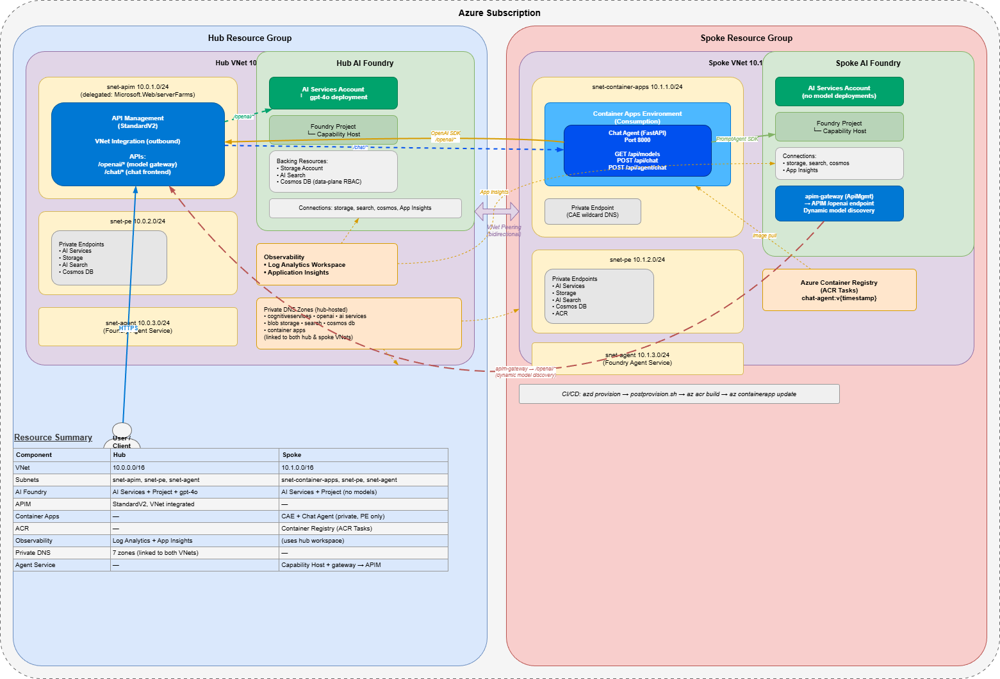

# Model Gateway Landing Zone

> **Disclaimer:** This is a personal project and is not affiliated with, endorsed by, or representative of my employer. It is provided as-is, without warranty of any kind. Use at your own risk — no liability is assumed for any damages arising from the use of this code.

Hub-and-spoke architecture on Azure providing a central AI model gateway (API Management) with observability, fronting Azure AI Foundry backends. Spokes consume models via the hub and host workloads on Container Apps.

> **Note:** The included chat agent is an **autonomous agent** with a demo UI — it operates under its own identity without user impersonation. No on-behalf-of or delegated user flows are implemented. For the Digital Colleague pattern (agent acting as a user with mailbox, Teams, etc.), see the [Entra Agent ID preview guide](https://github.com/astaykov/entra-agent-id-preview-guide).

## Architecture



See [architecture.drawio](architecture.drawio) for the editable diagram (open with [draw.io](https://app.diagrams.net/) or the VS Code draw.io extension).

### Traffic Flows

```
  Flow 1: LangGraph Agent (POST /chat)
  ─────────────────────────────────────

  User ──► APIM /chat/* ──► (VNet) ──► Spoke CAE (PE) ──► Chat Agent /api/chat
                                          │
                                          └──► LangGraph ReAct Agent
                                                  │
                                                  ├──► AzureChatOpenAI ──► APIM /openai/*
                                                  │                          │
                                                  │                          └──► Hub AI Services
                                                  │                               (gpt-4.1)
                                                  │
                                                  └──► list_files tool (optional)
                                                         │
                                                         └──► Auth Sidecar ──► Storage API

  Flow 2: Agent Chat (POST /agent/chat)
  ────────────────────────────────────

  User ──► APIM /chat/* ──► (VNet) ──► Spoke CAE (PE) ──► Chat Agent /api/agent/chat
                                          │
                                          └──► PromptAgent SDK ──► Spoke Foundry
                                                     │              (Agent Service)
                                                     │                   │
                                                     │                   ▼
                                                     │          apim-gateway conn
                                                     │                   │
                                                     │                   ▼
                                                     │            APIM /openai/*
                                                     │                   │
                                                     │                   ▼
                                                     │          Hub AI Services
                                                     │               (gpt-4o)
                                                     │
                                                     └──► Response with agent_reference
                                                          uses responses.create()

  Flow 3: Model Discovery (GET /models)
  ────────────────────────────────────

  User ──► APIM /chat/* ──► (VNet) ──► Spoke CAE (PE) ──► Chat Agent /api/models
                                          │
                                          └──► httpx ──► APIM /openai/deployments
                                                              │
                                                              └──► ARM API (dynamic
                                                                   model discovery)

  CI / CD  (postprovision hook)
  ─────────────────────────────

  azd provision ──► Bicep deploys infra ──► postprovision.sh hook
                                                  │
                                                  ├─ az acr build (cloud build)
                                                  │   └─ chat-agent:{timestamp}
                                                  │
                                                  ├─ az containerapp update
                                                  │   └─ sets new image + port 8000
                                                  │
                                                  └─ azd env set CHAT_AGENT_IMAGE
                                                      └─ persists tag for next run
```

### Resource Summary

| Component | Hub | Spoke |
|---|---|---|
| **VNet** | 10.0.0.0/16 | 10.1.0.0/16 |
| **Subnets** | snet-apim, snet-pe, snet-agent | snet-container-apps, snet-pe, snet-agent |
| **AI Foundry** | AI Services + Project + gpt-4o | AI Services + Project (no models) |
| **APIM** | StandardV2, VNet integrated | — |
| **Container Apps** | — | CAE + Chat Agent + Auth Sidecar (optional) |
| **ACR** | — | Container Registry (ACR Tasks) |
| **Storage** | File storage for agents | Spoke storage + blob container (optional, for Agent Identity) |
| **Observability** | Log Analytics + App Insights | A365 Observability (preview) |
| **Private DNS** | 7 zones (linked to both VNets) | — |
| **Agent Service** | — | Capability Host + gateway connection → APIM |

## Prerequisites

- [Azure CLI](https://learn.microsoft.com/cli/azure/install-azure-cli) ≥ 2.67
- [Azure Developer CLI (azd)](https://learn.microsoft.com/azure/developer/azure-developer-cli/install-azd) ≥ 1.11
- [Bicep CLI](https://learn.microsoft.com/azure/azure-resource-manager/bicep/install) ≥ 0.30
- An Azure subscription with **Contributor** access
- Quota for Azure OpenAI models (e.g., GPT-4o) in the target region

> **⚠️ Required: Register the `Microsoft.Web` resource provider**
>
> APIM StandardV2 with VNet integration requires the `Microsoft.Web` resource provider to be registered in your subscription (for subnet delegation to `Microsoft.Web/serverFarms`). **Deployment will fail with `ActivationFailed` if this is not registered.**
>
> ```bash
> # Check registration status
> az provider show -n Microsoft.Web --query registrationState -o tsv
>
> # Register if "NotRegistered"
> az provider register -n Microsoft.Web
>
> # Wait for registration to complete (~1-2 minutes)
> az provider show -n Microsoft.Web --query registrationState -o tsv
> ```

## Quick Start

```bash
# 1. Clone the repository
git clone git@github.com:jplck/aigw_lz.git
cd aigw_lz

# 2. Log in to Azure
azd auth login
az login

# 3. Initialize environment
azd init -e dev

# 4. Set required environment variables
azd env set AZURE_LOCATION swedencentral
azd env set APIM_PUBLISHER_EMAIL your-email@company.com

# 5. Deploy everything
azd up
```

Deployment takes approximately **45–60 minutes** (APIM Developer SKU alone takes ~30 min).

## What Gets Deployed

### Hub (`rg-aigw-hub-{env}`)

| Resource | Purpose |
|---|---|
| Virtual Network | Hub networking with APIM, PE, and Agent subnets |
| Private DNS Zones (6) | Name resolution for private endpoints |
| Log Analytics + App Insights | Central observability stack |
| AI Foundry (AI Services) | Model hosting with capability hosts pattern |
| Storage Account | File storage for agents |
| AI Search | Vector storage for agents |
| Cosmos DB (Serverless) | Thread / message storage for agents |
| API Management | Model gateway with OpenAI-compatible API |
| Private Endpoints | Secure connectivity for all PaaS services |

### Spoke (`rg-aigw-spoke-{env}`)

| Resource | Purpose |
|---|---|
| Virtual Network | Spoke networking, peered to hub |
| Container Registry | Image storage for workload containers |
| Container Apps Environment | Agent / app hosting platform |
| Sample Container App | Placeholder app wired to APIM gateway |

### Optional: Spoke Foundry

When `deploySpokeFoundry=true`, a second AI Foundry instance is deployed in the spoke with a gateway connection back to the hub APIM. This enables Foundry Agent Service in the spoke to use hub-managed models.

```bash
azd env set DEPLOY_SPOKE_FOUNDRY true
azd up
```

### Optional: Entra Agent Identity (Auth Sidecar)

The landing zone supports [Entra Agent Identity](https://learn.microsoft.com/en-us/entra/msidweb/agent-id-sdk/) for workload authentication. When enabled, an auth sidecar container runs alongside the chat agent and handles the full token exchange chain — the application code never touches credentials.

**Token flow:**
```
Container App MI → FIC → Blueprint → Agent Identity → Resource Token
```

**Concepts:**

| Artefact | What it is |
|---|---|
| **Blueprint** | App registration template (`AgentIdentityBlueprint`) — trust anchor, FIC target, API scope definition |
| **Agent Identity** | Runtime service principal (`AgentIdentity`) — the actual identity that accesses resources (RBAC roles assigned here) |
| **Auth Sidecar** | Container (`mcr.microsoft.com/entra-sdk/auth-sidecar`) running at `localhost:8080` — acquires tokens for downstream APIs |
| **FIC** | Federated Identity Credential linking the Container App's managed identity to the Blueprint |

**Prerequisites:**

- A management app registration with:
  - `Application.ReadWrite.OwnedBy` Graph application permission (admin consented)
  - `Agent ID Administrator` directory role assigned to its service principal
- Your tenant must be onboarded to the Entra Agent ID preview

**Setup:**

```bash
# 1. Set management app credentials
azd env set AGENT_MGMT_CLIENT_ID "<management-app-client-id>"
azd env set AGENT_MGMT_CLIENT_SECRET "<management-app-client-secret>"

# 2. Deploy infrastructure first (creates the Container App + MI)
azd up

# 3. Run the agent identity setup script
#    Creates: Blueprint → Blueprint SP → Agent Identity → FIC
#    The script is idempotent — safe to re-run
./scripts/setup_agent_identity.sh

# 4. Redeploy with the auth sidecar enabled
#    (The script sets ENABLE_AUTH_SIDECAR=true + BLUEPRINT_APP_ID + AGENT_IDENTITY_APP_ID in azd env)
azd up

# 5. (Optional) Set up Agent Identity + RBAC (the script handles role assignments)
./scripts/setup_agent_identity.sh

# 6. Redeploy with auth sidecar enabled
azd up
```

The setup script prints the Agent Identity object ID and app ID at the end. These are also saved in `azd env` as `AGENT_IDENTITY_APP_ID` and `BLUEPRINT_APP_ID`.

**What happens when enabled:**

- A sidecar container joins the chat agent pod, exposing `http://localhost:8080`
- The sidecar is configured with `DownstreamApis` for CognitiveServices, Storage, and AgentToken
- The chat agent calls `GET http://localhost:8080/AuthorizationHeaderUnauthenticated/{ApiName}?AgentIdentity={id}` to get Bearer tokens
- The `/api/files` endpoint and `list_files` LangGraph tool use the Storage token to list blobs

**Related parameters:**

| Parameter | Default | Description |
|---|---|---|
| `enableAuthSidecar` | `false` | Deploy the auth sidecar alongside the chat agent |
| `entraIdTenantId` | `""` | Entra tenant ID |
| `blueprintAppId` | `""` | Blueprint app (client) ID |
| `agentIdentityAppId` | `""` | Agent Identity app (client) ID |
| `enableA365Observability` | `false` | Enable A365 observability telemetry exporter (preview) |

**Reference:** [Entra Agent ID preview guide](https://github.com/astaykov/entra-agent-id-preview-guide)
**Reference:** [Entra Agent ID with Azure Apps](https://github.com/ivanthelad/agentid-app-fic)
### A365 Observability (Preview)

> **Preview:** A365 observability is currently in preview. APIs and telemetry schemas may change.

The [Microsoft Agent 365 SDK](https://learn.microsoft.com/en-us/microsoft-agent-365/developer/agent-365-sdk?tabs=python) provides observability extensions that trace LangGraph agent executions end-to-end. Telemetry is exported to the Agent365 backend using a token acquired via the auth sidecar.

**What gets traced:**

| Scope | Captured Data |
|---|---|
| `InvokeAgentScope` | Full agent invocation — input/output messages, session/correlation IDs |
| `InferenceScope` | LLM calls — model name, provider, input/output token counts, finish reasons |
| `ExecuteToolScope` | Tool executions — tool name, arguments, results |
| `BaggageBuilder` | Correlation context — tenant ID, agent ID, correlation ID |

The `CustomLangChainInstrumentor` automatically instruments LangChain/LangGraph chains. On startup, the chat agent configures A365 with a token resolver that calls the auth sidecar's `/AuthorizationHeaderUnauthenticated/AgentToken` endpoint.

**Enable:**

```bash
azd env set ENABLE_A365_OBSERVABILITY true
azd up
```

**Required packages** (installed automatically when enabled):

```
microsoft-agents-a365-observability-core==0.1.0
microsoft-agents-a365-observability-extensions-langchain==0.1.0
```

**Prerequisites:** The auth sidecar must be configured (`AGENTID_SIDECAR_URL` and `AGENT_IDENTITY_APP_ID`). See the [Agent Identity Guide](agent-identity-guide.md) for the full setup.
## Parameters

| Parameter | Default | Description |
|---|---|---|
| `location` | `swedencentral` | Azure region |
| `environmentName` | `dev` | Environment name |
| `projectName` | `aigw` | Resource naming prefix |
| `deploySpokeFoundry` | `false` | Deploy spoke Foundry with Agent Service |
| `publisherEmail` | `admin@contoso.com` | APIM publisher email |
| `publisherName` | `AI Gateway Team` | APIM publisher name |
| `hubModelDeployments` | `[gpt-4o]` | Models to deploy on hub Foundry |
| `enableAuthSidecar` | `false` | Deploy Agent ID auth sidecar alongside chat agent |
| `enableA365Observability` | `false` | Enable A365 observability telemetry exporter (preview) |

## Testing the Gateway

After deployment, test inference through the APIM gateway:

```bash
# Get the APIM gateway URL and subscription key
APIM_URL=$(az apim show -n <apim-name> -g rg-aigw-hub-dev --query gatewayUrl -o tsv)
SUB_KEY=$(az rest --method post \
  --url "https://management.azure.com/subscriptions/{sub}/resourceGroups/rg-aigw-hub-dev/providers/Microsoft.ApiManagement/service/{apim}/subscriptions/spoke-subscription/listSecrets?api-version=2024-05-01" \
  --query primaryKey -o tsv)

# Call chat completions
curl -X POST "${APIM_URL}/openai/deployments/gpt-4o/chat/completions?api-version=2024-10-21" \
  -H "api-key: ${SUB_KEY}" \
  -H "Content-Type: application/json" \
  -d '{
    "messages": [{"role": "user", "content": "Hello!"}],
    "max_tokens": 100
  }'
```

## Repository Structure

```
├── azure.yaml                          # azd project definition (postprovision hook)
├── infra/
│   ├── main.bicep                      # Subscription-scoped orchestrator
│   ├── main.bicepparam                 # Parameters file
│   └── modules/
│       ├── hub/
│       │   ├── networking.bicep        # Hub VNet, subnets, NSGs
│       │   ├── dns.bicep               # Private DNS zones + VNet links
│       │   ├── observability.bicep     # Log Analytics + App Insights
│       │   ├── foundry.bicep           # AI Foundry (caphost pattern, reusable)
│       │   ├── apim.bicep              # API Management model gateway
│       │   ├── apim-chat-api.bicep     # APIM chat frontend API
│       │   ├── cae-dns-wildcard.bicep  # CAE private DNS wildcard record
│       │   └── policies/
│       │       └── openai-api-policy.xml
│       ├── spoke/
│       │   ├── networking.bicep        # Spoke VNet, subnets, NSGs
│       │   ├── container-apps.bicep    # ACR + Container Apps (private)
│       │   └── foundry-role.bicep      # Container App → Foundry RBAC
│       ├── peering.bicep               # VNet peering helper
│       └── dns-zone-link.bicep         # DNS zone link helper
├── apps/
│   └── chat-agent/
│       ├── config.py                   # Shared configuration (env vars)
│       ├── inference.py                # LangGraph ReAct agent, tools, blob storage
│       ├── foundry_agent.py            # Foundry Agent Service integration
│       ├── main.py                     # FastAPI routes, A365 observability setup
│       ├── Dockerfile                  # Python 3.12-slim, port 8000
│       ├── requirements.txt            # LangChain, LangGraph, A365, FastAPI
│       └── static/
│           └── index.html              # Chat UI with model selector + tool call display
├── scripts/
│   ├── postprovision.sh               # Build + deploy hook (ACR Tasks)
│   ├── preprovision.sh                # Optional feature prompts (A365 observability)
│   ├── setup_agent_identity.sh        # Agent Identity setup (Blueprint, FIC, RBAC)
│   ├── deploy-chat-agent.sh           # Manual build + deploy
│   └── test-gateway.sh                # Gateway test suite
├── agent-identity-guide.md            # Entra Agent Identity implementation guide
├── spec.md                             # Architecture specification
└── tasks.md                            # Implementation task list
```

## Adding a Second Foundry Backend (Phase 5)

To add load balancing across multiple Foundry instances, deploy another Foundry module and update APIM:

1. Add a second `hubFoundry2` module call in `main.bicep` with `instanceSuffix: 'hub2'`
2. Register the new endpoint as an additional APIM backend
3. Update `openai-api-policy.xml` to use a backend pool with round-robin routing

## Routing to Non-Foundry Model Backends

The APIM gateway is not limited to Azure AI Foundry — it can route to **any OpenAI-compatible backend**. Since the gateway exposes a standard `/openai/*` API surface, you can add additional backends behind the same endpoint:

- **Azure OpenAI Service** (standalone, without Foundry)
- **Self-hosted models** — vLLM, Ollama, TGI, or any container exposing an OpenAI-compatible API
- **Third-party providers** — OpenAI direct, Anthropic (via an adapter), or any API-compatible proxy
- **Other Azure AI Foundry instances** — in different regions or subscriptions for geo-routing

### How to Add a Custom Backend

1. **Register a new APIM backend** pointing to your model endpoint:

   ```bicep
   resource customBackend 'Microsoft.ApiManagement/service/backends@2024-05-01' = {
     name: 'custom-model-backend'
     parent: apim
     properties: {
       url: 'https://my-vllm-server.internal:8000'
       protocol: 'http'
     }
   }
   ```

2. **Update the APIM policy** (`openai-api-policy.xml`) to route specific deployments to the new backend — for example, route by deployment name:

   ```xml
   <choose>
     <when condition="@(context.Request.MatchedParameters["deployment-id"] == "llama-3")">
       <set-backend-service backend-id="custom-model-backend" />
     </when>
     <otherwise>
       <set-backend-service backend-id="foundry-backend" />
     </otherwise>
   </choose>
   ```

3. **Adjust authentication** per backend — the existing policy uses managed identity for Foundry, but custom backends may need API keys, mTLS, or no auth at all:

   ```xml
   <!-- For backends that need an API key instead of MI auth -->
   <set-header name="Authorization" exists-action="override">
     <value>Bearer {{custom-backend-api-key}}</value>
   </set-header>
   ```

Spoke consumers don't need to change anything — they continue calling APIM `/openai/*` with their subscription key, and APIM routes to the correct backend transparently.

## Security Hardening (Phase 9)

For production-like security:

1. Set `publicNetworkAccess: 'Disabled'` on all Foundry, Storage, Search, Cosmos DB resources
2. Set `networkAcls.defaultAction: 'Deny'` on Foundry accounts
3. Switch APIM to external VNet mode with `virtualNetworkType: 'External'`
4. Set Container Apps Environment `internal: true`
5. Configure Cosmos DB firewall to allow only Azure services and known IPs

## Related Samples

- **[Azure AI Hosted Agents with azd](https://github.com/jplck/msft-foundry-hosted-agents-sample)** — Full sample for hosted agents and workflows using Azure AI Foundry. Shows how to build container-based agents (LangGraph, agent-framework), push to ACR, register as `ImageBasedHostedAgentDefinition`, and orchestrate multi-agent workflows — all automated via `azd up`.

## License

See [LICENSE](LICENSE).
